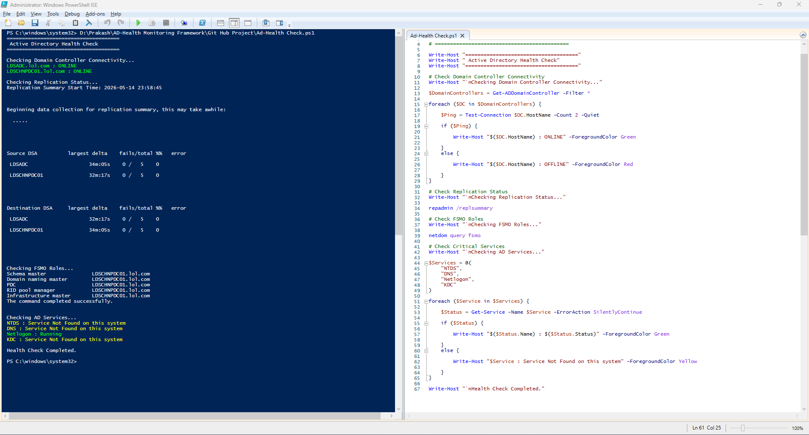

# Active Directory Health Monitoring Framework

Enterprise-grade Active Directory Health Monitoring & Reporting Framework developed using PowerShell.

---

## Project Overview

This project is designed to monitor and validate the health status of Active Directory infrastructure in enterprise environments.

The framework performs automated health checks for:

- Domain Controllers
- Replication Status
- DNS Health
- FSMO Roles
- SYSVOL Replication
- Services Status
- Event Log Monitoring
- Network Connectivity
- Time Synchronization
- Active Directory Services

The goal of this framework is to proactively identify infrastructure issues before they impact production environments.

---

## Technologies Used

- PowerShell
- Windows Server
- Active Directory
- DNS
- Group Policy
- Task Scheduler
- HTML Reporting
- Enterprise Infrastructure Monitoring

---
## Project Execution Screenshot

Below screenshot demonstrates the execution of the Active Directory Health Monitoring Framework in a production environment.

---

## Key Features

### Automated Health Checks
Performs automated validation of critical Active Directory services and infrastructure components.

### HTML Reporting
Generates professional HTML health reports for administrators and management.

### Replication Monitoring
Checks Active Directory replication health across domain controllers.

### DNS Validation
Monitors DNS resolution and service availability.

### Service Monitoring
Validates critical Windows and Active Directory services.

### Event Log Analysis
Analyzes system and Active Directory related event logs for warnings and errors.

### Infrastructure Visibility
Provides centralized visibility into Active Directory operational health.

---

## Use Cases

- Enterprise Infrastructure Monitoring
- Preventive Maintenance
- Daily Health Validation
- Infrastructure Auditing
- Troubleshooting
- Operational Reporting

---

## Future Enhancements

- Email Alert Integration
- Dashboard Integration
- Real-time Monitoring
- Multi-site Monitoring
- Scheduled Reporting
- Teams Notification Integration

---

## Author

Prakash Palanivel  
Infrastructure & System Administration Engineer

GitHub:
https://github.com/prakash-palanivel

Portfolio:
https://prakash-palanivel.github.io/portfolio/
